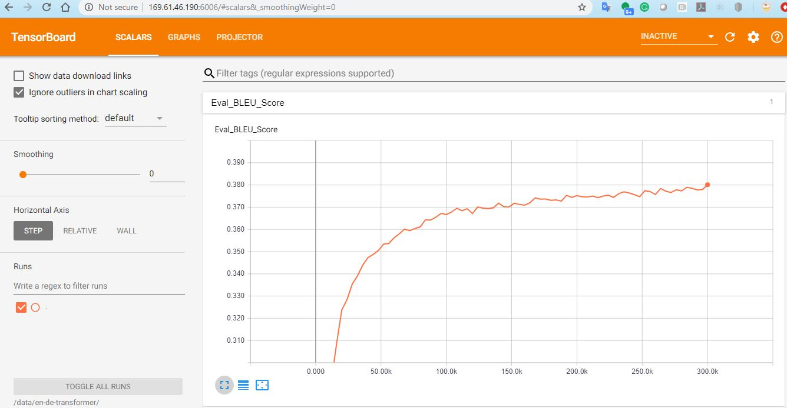
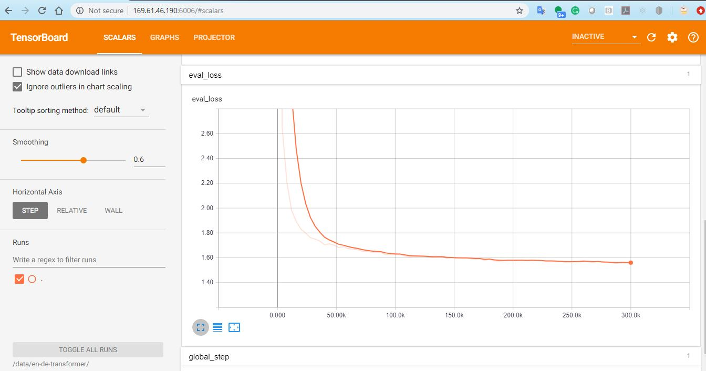
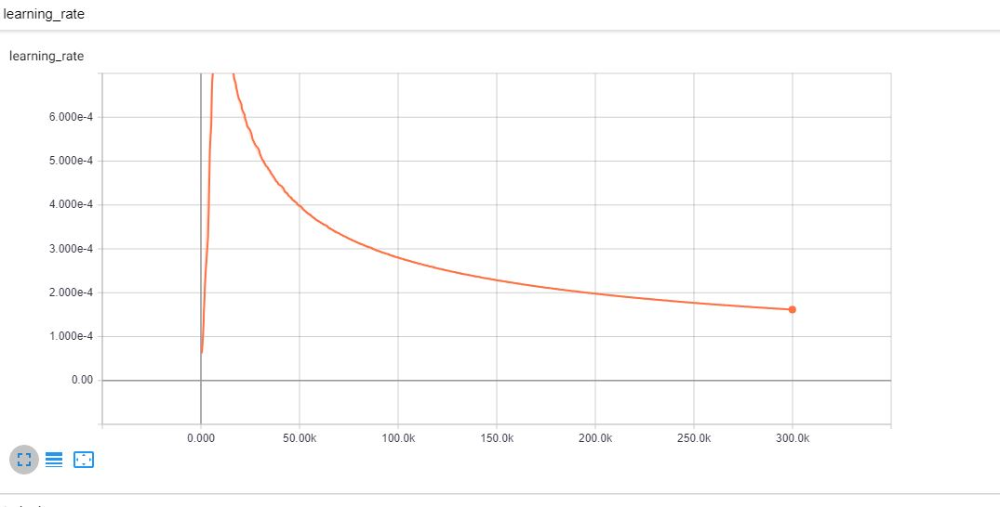

# Homework 9: [is being revised, please do not start it yet] Distributed Training

### Read up on OpenSeq2Seq
Nvidia [OpenSeq2Seq](https://github.com/NVIDIA/OpenSeq2Seq/) is a framework for sequence to sequence tasks such as Automatic Speech Recognition (ASR) and Natural Language Processing (NLP), written in Python and TensorFlow. Many of these tasks take a very long to train, hence the need to train on more than one machine.  In this week's lab, we'll be training a [Transformer-based Machine Translation network](https://nvidia.github.io/OpenSeq2Seq/html/machine-translation/transformer.html) on a small English to German WMT corpus.

### Get a pair of GPU VMs in Softlayer
Follow instructions in [Homework 6](https://github.com/MIDS-scaling-up/v2/tree/master/week06/hw) to get a pair of 2*P-100 or 2*V-100 VMs in Softlayer (remember that V-100s are about 3x faster than P-100s in mixed training).  Call them, for instance, p100a and p100b.  If you are provisioning from our image, docker and nvidia-docker will be already installed.  However, you will need to log into the [Softlayer Portal](http://control.softlayer.com) and add a second 2 TB SAN drive to each VM, then format the 2TB disk and mount it to /data on each VM as described [here](https://github.com/MIDS-scaling-up/v2/blob/master/week03/hw/digits/README.md) .  Once you are finished with the setup, you will have a micro-cluster consisting of 2 nodes and 4 P-100 or V-100 GPUs total.

### Create cloud containers for openseq2seq and distributed training

1. Create account at https://ngc.nvidia.com/
1. Follow [these instructions](https://docs.nvidia.com/ngc/ngc-getting-started-guide/index.html#generating-api-key) to create an Nvidia Cloud docker registry API Key, unless you already have one.
1. Login into one of the VMs and use your API key to login into Nvidia Cloud docker registry
1. Pull the latest tensorflow image with python3: ```docker pull nvcr.io/nvidia/tensorflow:19.05-py3```
1. Use the files on [docker directory](docker) to create an openseq2seq image 
1. Copy the created docker image to the other VM (or repeat the same steps on the other VM) 
1. Create containers on both VMs: ``` docker run --runtime=nvidia -d --name openseq2seq --net=host -e SSH_PORT=4444 -v /data:/data -p 6006:6006 openseq2seq ```
1. On each VM, create an interactive bash sesion inside the container: ``` docker exec -ti openseq2seq bash ``` and run the following commands in the container shell:
    1. Test mpi: ``` mpirun -n 2 -H <vm1 private ip address>,<vm2 private ip address> --allow-run-as-root hostname ``` 
    1. Pull data to be used in neural machine tranlsation training ([more info](https://nvidia.github.io/OpenSeq2Seq/html/machine-translation.html)):  
    ``` 
    cd /opt/OpenSeq2seq 
    scripts/get_en_de.sh /data/wmt16_de_en
    ```
    1. Copy configuration file to /data directory: ``` cp example_configs/text2text/en-de/transformer-base.py /data ```
    1. Edit /data/transformer-base.py: replace ```[REPLACE THIS TO THE PATH WITH YOUR WMT DATA]``` with ```/data/wmt16_de_en/```,  in base_parms section replace ```"logdir": "nmt-small-en-de",``` with ```"logdir": "/data/en-de-transformer/",```  and make "batch_size_per_gpu": 128, in eval_params section set "repeat: to True. 
    1. Start training -- **on the first VM only:** ```nohup mpirun --allow-run-as-root -n 4 -H <vm1 private ip address>:2,<vm2 private ip address>:2 -bind-to none -map-by slot --mca btl_tcp_if_include eth0  -x NCCL_SOCKET_IFNAME=eth0 -x NCCL_DEBUG=INFO -x LD_LIBRARY_PATH  python run.py --config_file=/data/transformer-base.py --use_horovod=True --mode=train_eval & ```
    1. Monitor training progress: ``` tail -f nohup.out ```
    1. Start tensorboard on the same machine where you started training, e.g. ```nohup tensorboard --logdir=/data/en-de-transformer``` You should be able to monitor your progress by putting http://public_ip_of_your_vm1:6006 !
    1. If you are concerned about the costs of your VMs, feel free to kill them after 100,000 steps (the config file will make the model run for 300,000 steps unless you change the max_steps parameter or kill training by hand)
    1. After your training is done, download your best model to your jetson tx2.  [Hint: it will be located in /data/en-de-transformer on the first VM]  Alternatively, you could always download a checkpoint from Nvidia [here](https://nvidia.github.io/OpenSeq2Seq/html/machine-translation.html)
 
### Create the tx2 container for openseq2seq 
Let us create a tx2 compatible container for OpenSeq2Seq.  We probably won't be able to use it for training, but it could be useful for inference.  Make sure that you have a local TF container in your TX2 that we created when we completed during [HW 5](https://github.com/MIDS-scaling-up/v2/tree/master/week05/hw). (We also have all TF containers posted [in the W251 docker hub](https://cloud.docker.com/u/w251/repository/docker/w251/tensorflow) ). Then, use [this Dockerfile](https://github.com/MIDS-scaling-up/v2/blob/master/week09/hw/docker/arm64/Dockerfile.dev-tx2-4.2_b158-py3) . We will need this container for our in-class lab.  Put your downloaded best trained model someplace onto the external hard drive -- e.g. /data/en-de-transformer


### Submission

Please submit the nohup.out file along with screenshots of your Tensorboard indicating training progress (Blue score, eval loss) over time.  Also, answer the following (simple) questions:
* How long does it take to complete the training run? (hint: this session is on distributed training, so it will take a while)
* Do you think your model is fully trained? How can you tell?
* Were you overfitting?
* Were your GPUs fully utilized?
* Did you monitor network traffic (hint:  ```apt install nmon ```) ? Was network the bottleneck?
* Take a look at the plot of the learning rate and then check the config file.  Can you explan this setting?
* How big was your training set (mb)? How many training lines did it contain?
* What are the files that a TF checkpoint is comprised of?
* How big is your resulting model checkpoint (mb)?
* Remember the definition of a "step". How long did an average step take?
* How does that correlate with the observed network utilization between nodes?

### Hints
Your BLEU TB plot should look something like this:


Your loss should be something like:


And your learning rate  should be something like:

